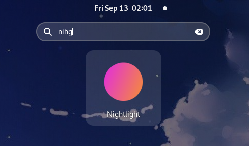

# gnomeorbs

Turn your scripts into GNOME ORBS.

Starting from any script or executable file:
```bash
$ cat ~/.local/bin/nightlight

#!/bin/bash
if [[ $(gsettings get org.gnome.settings-daemon.plugins.color night-light-enabled) == "true" ]]; then gsettings set org.gnome.settings-daemon.plugins.color night-light-enabled false; else gsettings set org.gnome.settings-daemon.plugins.color night-light-enabled true; fi
```

Run this program to generate a `.desktop` file for it and an icon:
```bash
$ gnomeorbs ~/.local/bin/nightlight

Selected executable file:
    /home/kekelp/.local/bin/nightlight
Target .desktop file:
    /home/kekelp/.local/share/applications/nightlight.desktop
Generated icon:
    /home/kekelp/.local/share/icons/hicolor/128x128/apps/nightlight.png
Completed.
```

Now you can call your script from the GNOME search by just pressing Super and typing the name:



- The generated `.desktop` file has the same name as the script, converted to Title Case.
- It includes common misspellings of the script name.
- The icon has a random hue seeded from the script name.

## Options

- `--overwrite` (`-o`): overwrite `.desktop` files or icons if they are already present. Without this flag, `gnomeorbs` will never overwrite anything.

- `--edit` (`-e`): open the generated `.desktop` file with the system default editor for further customization

- `--terminal` (`-t`): run the command in the terminal, by wrapping the command into `bash -c {command}; $SHELL"`. 

## Install

Binary for Linux x86-64: [gnomeorbs 1.0.0](https://github.com/kekelp/gnomeorbs/releases/tag/1.0.0)

Or just `cargo run --release`
